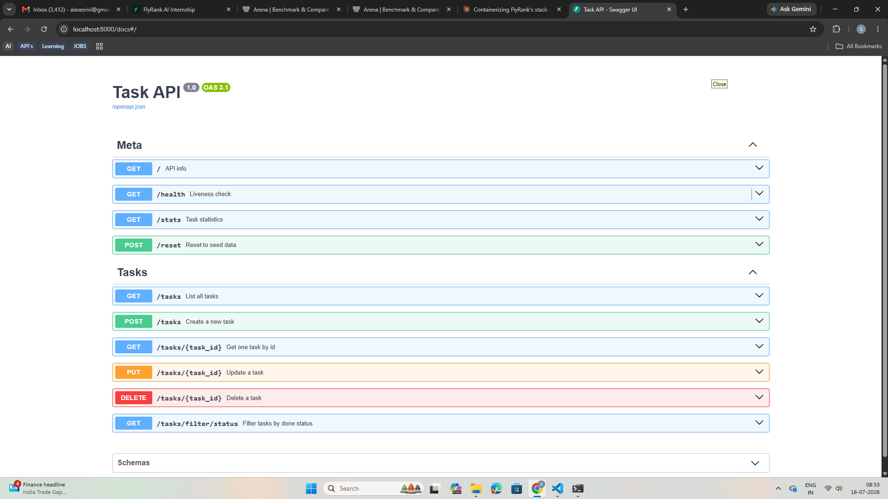

# Task API — CRUD API with FastAPI

A small in-memory task manager. Full CRUD (Create, Read, Update, Delete) with automatic Swagger UI.

Built as W2·A1 of the FlyRank AI Internship.

## Tech Stack

- Python 3.11
- FastAPI
- Uvicorn
- Pydantic (input validation)

## Quickstart

```bash
# Clone
git clone https://github.com/YOUR_USERNAME/TaskAPI.git
cd TaskAPI

# Setup
python -m venv .venv
.venv\Scripts\activate      # Windows
# source .venv/bin/activate  # Mac/Linux
pip install fastapi "uvicorn[standard]"

# Run
uvicorn main:app --reload
```

Server: http://localhost:8000
Swagger UI: http://localhost:8000/docs

## Endpoints

| Method | Path | Description | Success | Error |
|--------|------|-------------|---------|-------|
| GET | `/` | API info | 200 | — |
| GET | `/health` | Liveness check | 200 | — |
| GET | `/tasks` | List all tasks | 200 | — |
| GET | `/tasks/{id}` | Get one task | 200 | 404 |
| POST | `/tasks` | Create task | 201 | 422/400 |
| PUT | `/tasks/{id}` | Update task | 200 | 400, 404 |
| DELETE | `/tasks/{id}` | Delete task | 204 | 404 |
| GET | `/stats` | Task statistics | 200 | — |
| GET | `/tasks/filter/status?done=` | Filter by status | 200 | — |
| POST | `/reset` | Reset seed data | 200 | — |

## Example: Full CRUD via curl

```bash
$ curl -i -X POST http://localhost:8000/tasks \
    -H "Content-Type: application/json" \
    -d '{"title":"Buy milk"}'

HTTP/1.1 201 Created
content-type: application/json

{"id":4,"title":"Buy milk","done":false}
```

## Swagger UI



Interactive docs at `/docs` — every endpoint testable with "Try it out".

## The Mortality Experiment

The data lives in a Python list in memory. **Restart the server → all tasks reset to the 3 seed tasks.**

Why: no database. Every request touches an in-process variable that dies with the process. That's the whole reason Week 3 exists (persistence with a real database). Losing data on restart is a lesson, not a bug.

## Commit History

- Stage 0: hello server
- Stage 1: root and health endpoints
- Stage 2: read endpoints with 404
- Stage 3: create with validation
- Stage 4: full CRUD
- Stage 5: Swagger UI with descriptions and tags
- Extras: stats, filter, and reset endpoints
- Stage 6: publish and docs

## Author

Sairaj Narayankar